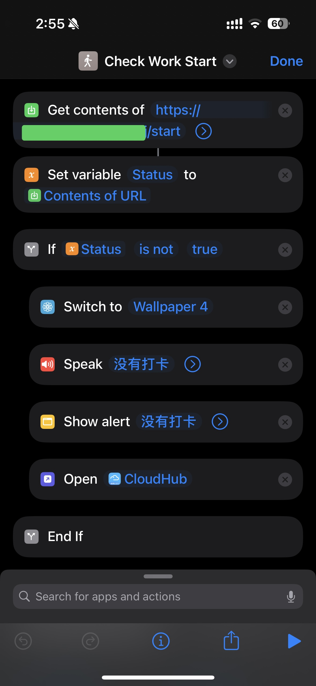

# YunZhiJia

检查当天云之家是否签到，与iOS捷径配合使用。

```
GET    /start        # 判断是否上班打卡，打卡返回`true`,否则返回`false`
GET    /end          # 判断是否下班打卡，打卡返回`true`,否则返回`false`
GET    /raw          # 原始打卡数据，只在debug模式有效
GET    /status       # 服务状态
```

## 使用方法

1. 抓包获得[配置](./init/config.json)所需信息
2. 部署到服务器
3. 配置iOS捷径
