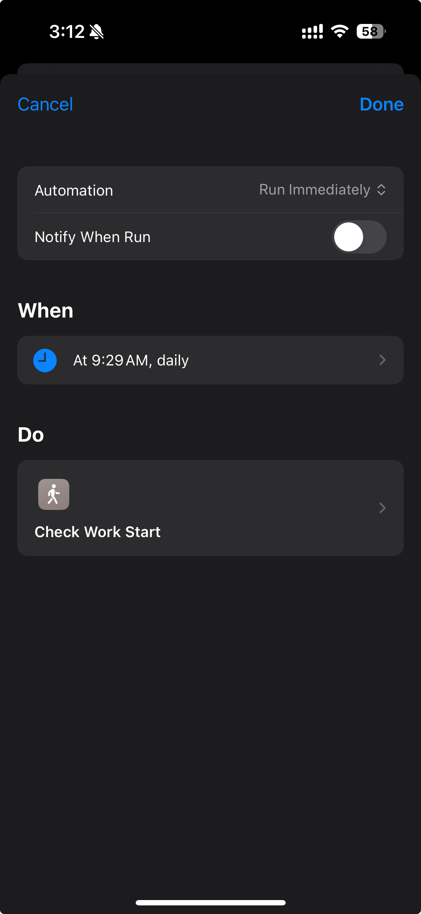

# YunZhiJia

检查当天云之家是否签到，与iOS捷径配合使用。

```
GET    /start        # 判断是否上班打卡，打卡返回`true`,否则返回`false`
GET    /end          # 判断是否下班打卡，打卡返回`true`,否则返回`false`
GET    /raw          # 原始打卡数据，只在debug模式有效
GET    /status       # 服务状态
```

## 使用方法

- 抓包获得[配置](./init/config.json)所需信息

- 部署到服务器

- 配置iOS捷径
<details>
<summary>展开捷径配置</summary>

</details>

- 添加定时运行iOS捷径
<details>
<summary>展开自动化配置</summary>

</details>
